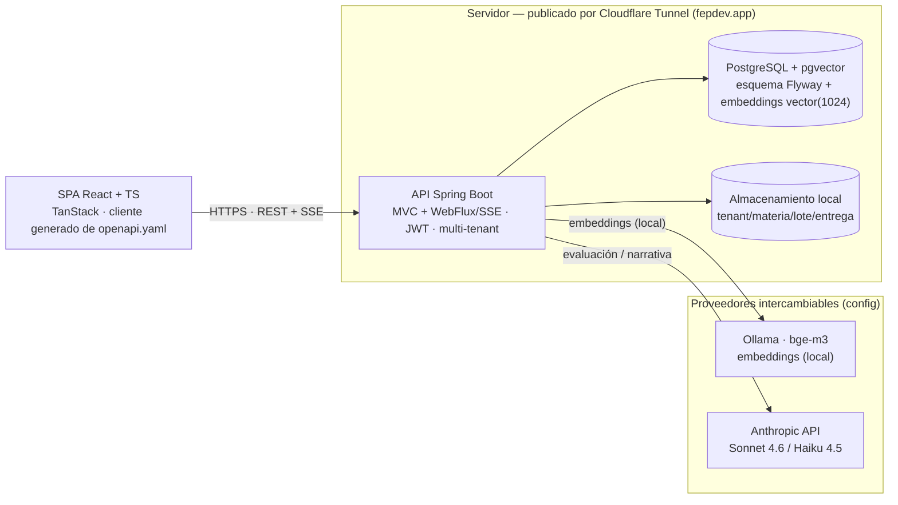
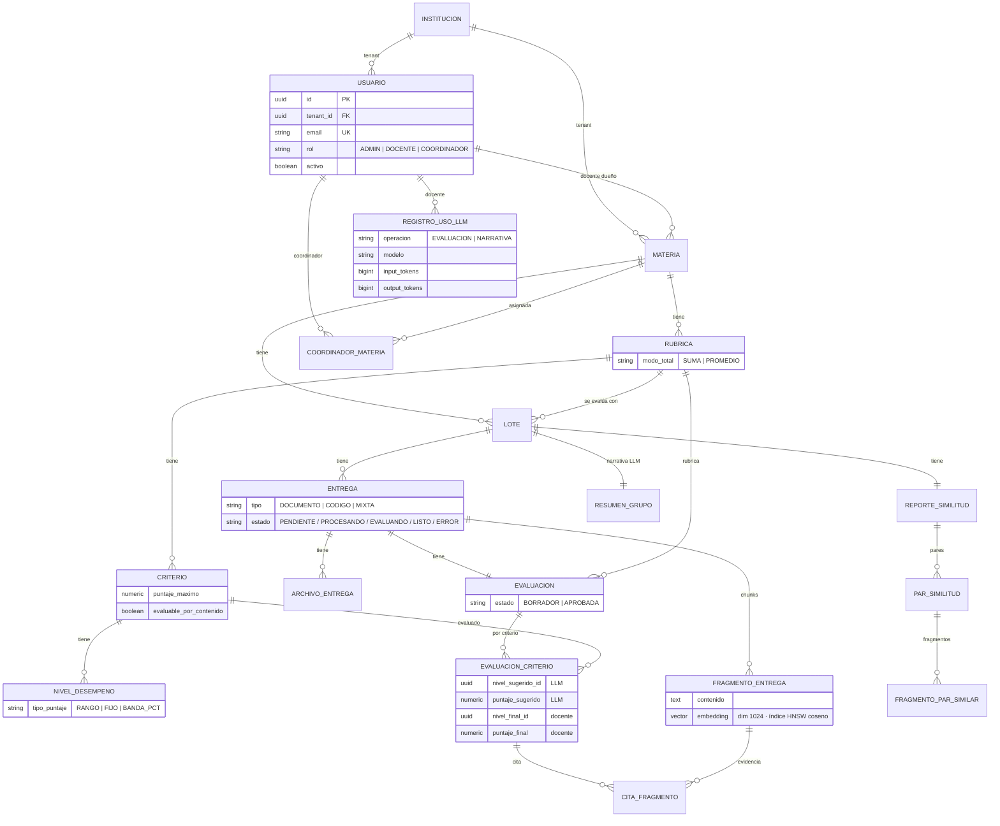
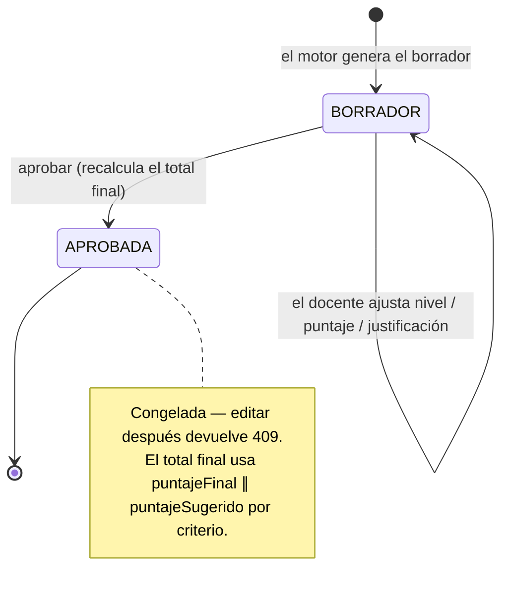
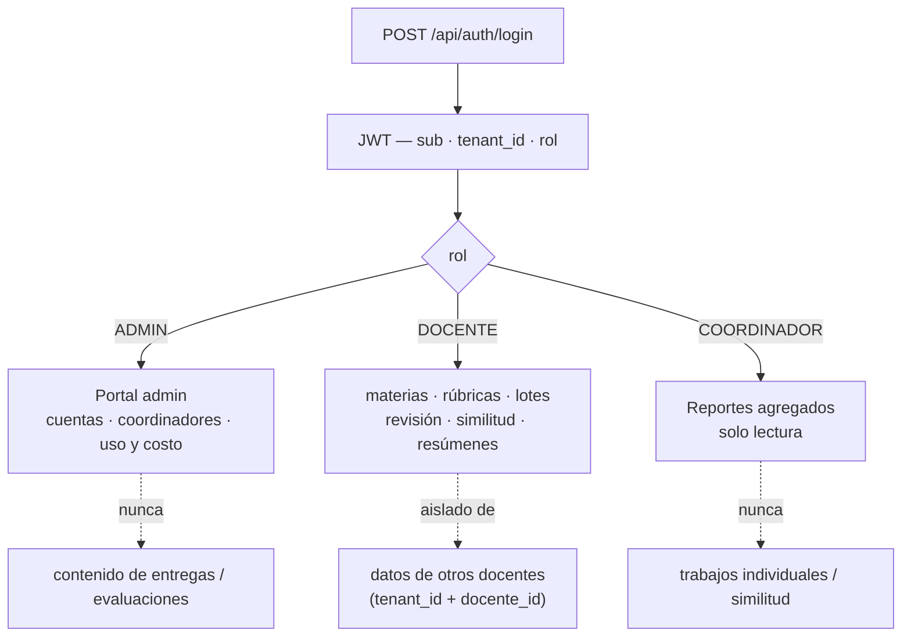
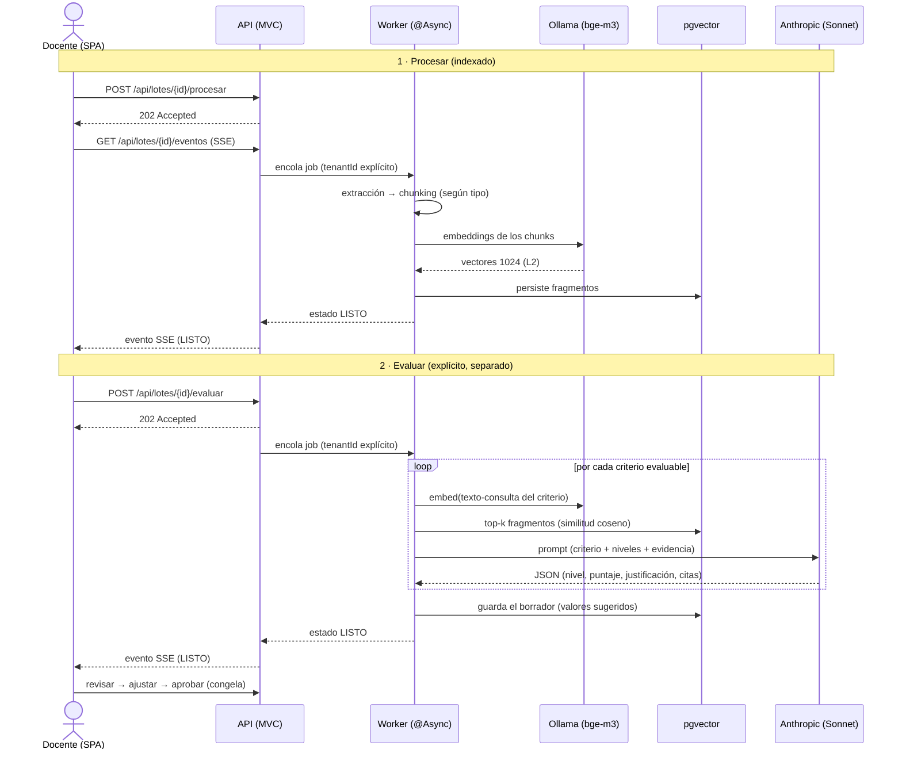
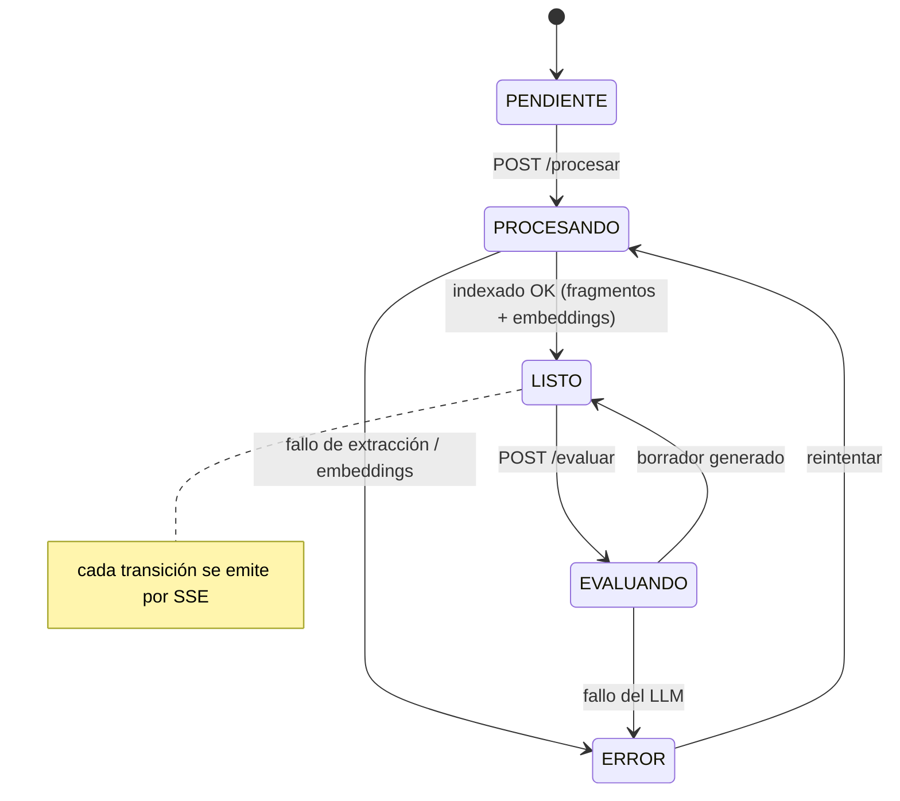

# DESIGN — classroomiq

Decisiones de diseño del backend de **classroomiq**, la plataforma de asistencia a evaluación docente universitaria. Este documento explica el *por qué* detrás de las decisiones, no el *cómo* operativo (eso vive en [`backend/README.md`](backend/README.md)) ni el contrato de la API (eso vive en [`openapi.yaml`](openapi.yaml)).

---

## 0. Arquitectura en un vistazo

### Componentes y dependencias

Una SPA habla con una única API Spring; el contenido sensible (archivos de entregas y embeddings) se queda en el servidor — **solo el LLM es cloud**. Los proveedores de LLM y embeddings son intercambiables (ver §7), así que el modo "nada sale del servidor" se logra cambiando configuración, no código.

### Modelo de datos

Todas las tablas llevan `tenant_id` (omitido en el diagrama salvo en `usuario` para no saturarlo) — es el eje del aislamiento (§2). Dos rasgos del esquema encarnan el principio inamovible: `evaluacion_criterio` guarda lo **sugerido** (LLM) separado de lo **final** (docente), y `fragmento_entrega` persiste el `embedding vector(1024)` que alimenta el RAG (§6) y la similitud (§8).

---

## 1. El principio inamovible: asistente, no reemplazante

> **El docente es el juez; la herramienta elimina el trabajo cognitivo repetitivo.**

classroomiq **nunca asigna una nota final**. Genera **borradores de evaluación fundamentados** — nivel sugerido, puntaje dentro del rango, justificación con evidencia citada del trabajo — que el docente revisa, ajusta y aprueba. La nota final es responsabilidad exclusiva del profesor.

Esta no es una decisión cosmética; es la decisión central de producto, y condiciona toda la
arquitectura:

- **Adopción vs. resistencia.** Una "IA que califica" genera rechazo institucional y profesional legítimo. Un "asistente que prepara la evaluación" reduce el tiempo de 45 a 15 minutos por trabajo manteniendo el criterio del docente. Esa diferencia es lo que convierte una demo en una conversación de adopción real.
- **Consecuencias técnicas concretas:**
  - El modelo de datos separa lo **sugerido** (por el LLM) de lo **final** (del docente): cada `evaluacion_criterio` tiene `nivelSugeridoId`/`puntajeSugerido` *y* `nivelFinalId`/`puntajeFinal`. El borrador nunca sobrescribe el juicio humano.
  - El motor LLM tiene **instrucciones inamovibles** (ver §6): citar evidencia textual, declarar explícitamente cuando el contenido es insuficiente en vez de inventar, no asignar puntajes fuera del rango del nivel, usar lenguaje objetivo y descriptivo.
  - Aprobar una evaluación **congela** sus valores (`APROBADA`); editarla después devuelve `409`.
  - El "botón de aprobar" no envía nada al estudiante — no hay portal estudiantil. El docente exporta y comunica por su canal habitual (Moodle, email, en clase).

El ciclo de vida de una evaluación deja explícito ese congelamiento:

---

## 2. Multi-tenancy y aislamiento de datos

La plataforma es multi-tenant con jerarquía de roles institucional (admin, docente, coordinador). Los datos de estudiantes son sensibles: nombres, notas, trabajos. El aislamiento es una propiedad de seguridad, no una conveniencia.

### Dos niveles de aislamiento

1. **Por tenant (institución):** multi-tenancy por **discriminador de Hibernate 6** (`@TenantId` en `AbstractTenantEntity`). Hibernate estampa `tenant_id` en cada INSERT y añade `tenant_id = :actual`    a cada SELECT/UPDATE/DELETE de forma automática y transversal — incluido `findById`. No hay forma de "olvidar" el filtro en una query.
2. **Por docente:** dentro de un mismo tenant, los repositorios filtran además por `docente_id`. Un docente no ve materias, rúbricas, entregas ni evaluaciones de otro.

### Fail-closed por defecto

La fuente del tenant es un `TenantContext` **ThreadLocal fail-closed**: si no hay tenant fijado, devuelve el UUID cero (`SIN_TENANT`), que no coincide con ninguna institución real. El resultado es que **una query sin tenant no devuelve filas**, en lugar de cruzar datos entre instituciones. El modo de fallo seguro es "no ver nada", nunca "ver todo".

### Propagación explícita, no implícita

El `TenantFilter` puebla el `TenantContext` desde el JWT en cada request. Pero el procesamiento y la evaluación corren en **hilos de fondo** (`@Async`), donde no hay request ni `SecurityContext`. Ahí el tenant se propaga con un **job auto-describible**: el `tenantId` viaja explícito en el job y se fija con `TenantContext.set(...)` en un `try/finally`, más un `TaskDecorator` como red de seguridad. Se prefirió la propagación explícita a la mágica para que sea auditable.

### Cuidado con el SQL nativo

El discriminador de `@TenantId` solo aplica a las consultas gestionadas por Hibernate. Las consultas **SQL nativas** (p. ej. el retrieval coseno `<=>` sobre pgvector, o el login por email) **no** lo aplican. Por eso esas consultas filtran `tenant_id` **explícitamente** en el SQL. Es la excepción que confirma la regla, y está documentada en cada caso.

### `404`, no `403`, para recursos ajenos

Acceder a un recurso de otro tenant/docente responde `404`, indistinguible de "no existe". Un `403` filtraría la existencia del recurso ("existe pero no es tuyo"); el `404` no revela nada.

### El coordinador: visibilidad sin acceso operativo

El coordinador es un rol de solo lectura sobre **reportes agregados** de las materias que el admin le asigna. Ve resúmenes por grupo y estadísticas por criterio — **nunca** trabajos individuales, evaluaciones específicas ni reportes de similitud (que revelan pares concretos de estudiantes). El acceso es por **asignación** (`coordinador_materia`), no por propiedad. Es la misma lógica de privacidad aplicada hacia arriba en la jerarquía: visibilidad institucional sin exposición de lo individual.

### Roles y fronteras de un vistazo

Tras el login, el `rol` del JWT decide el portal; cada rol tiene una frontera de lo que **nunca** ve:

---

## 3. Autenticación: JWT propio, sin self-signup

- **JWT propio HMAC HS256**, validado con el soporte de OAuth2 resource server de Spring Security. No se usó un IdP externo: la institución es el dominio de confianza, y el JWT porta exactamente lo que el aislamiento necesita — `sub` (usuarioId), `tenant_id`, `rol`, `email`.
- **El admin crea las cuentas; no hay registro abierto.** Es coherente con el modelo institucional: la herramienta la adopta una institución, no usuarios sueltos. El claim `rol` se mapea a `ROLE_<ROL>` y la autorización es declarativa (`@PreAuthorize`).
- **Login sin tenant previo:** el login ocurre *antes* de conocer el tenant (el usuario solo da su email). Por eso la búsqueda de login usa una query nativa que ignora el discriminador (`findByEmailAcrossTenants`); el email es único globalmente. Es el caso de borde que justifica la excepción de SQL nativo de §2.

---

## 4. El modelo de rúbrica: puntos absolutos, niveles por criterio

El documento de visión original describía rúbricas con "peso % que suma 100". Al modelar **rúbricas reales** de la carrera de Ingeniería en Sistemas, esa forma resultó insuficiente. El esquema final:

- **Puntos absolutos por criterio** (no porcentajes que suman 100). Cada criterio tiene un `puntajeMaximo`; el total de la rúbrica se calcula por `ModoTotal`:
  - `SUMA` — el total es la suma de los criterios.
  - `PROMEDIO` — el total es el promedio (cada criterio puntúa sobre el mismo máximo).
- **Niveles por criterio** (mínimo 2, no 3). Cada nivel acepta **tres formas de puntaje**
  (`TipoPuntaje`):
  - `RANGO` — un intervalo `[min, max]` (lo más común).
  - `FIJO` — un valor único.
  - `BANDA_PCT` — un porcentaje del puntaje máximo del criterio.
- **`evaluablePorContenido`** — bandera por criterio. Los criterios que requieren juicio humano que el LLM no puede emitir desde el texto (una demo en vivo, una exposición oral) se marcan `false`: el motor los deja **en blanco** con una advertencia explícita "requiere juicio del docente", en vez de inventar una evaluación.

La coherencia de puntajes se valida al crear/editar la rúbrica (suma o promedio == total según el modo, niveles dentro de rango, mínimo de niveles) → `422` si es incoherente. Modelar el dominio real antes de codificar evitó construir sobre un esquema que no representaba las rúbricas que los docentes usan de verdad.

---

## 5. Procesamiento de entregas: extracción → chunking → embeddings → pgvector

El sistema soporta tres tipos de entrega desde el MVP: documento escrito (PDF/DOCX), código fuente
(ZIP), y mixta (documento + código). El pipeline:

1. **Extracción de texto** según el tipo: PDFBox (PDF, limpia numeración y headers/footers recurrentes), POI (DOCX, por secciones), y un extractor de código que descomprime el ZIP, filtra por extensión, ignora dependencias (`node_modules`, `.git`, `__pycache__`, `target`), aplica guardas anti zip-bomb y parsea notebooks `.ipynb` celda por celda. El texto plano (`md`/`txt`/`rst`) se trata como prosa.
2. **Chunking** consciente del tipo: la prosa se parte por párrafos; el código por líneas conservando el rango, con solape para no perder contexto en las fronteras.
3. **Embeddings**: `bge-m3` (multilingüe, fuerte en español) vía Ollama local, **dimensión 1024**, vectores normalizados L2. Se persisten en columnas `vector(1024)` con índice **HNSW** (`vector_cosine_ops`) de pgvector.

**Decisión de privacidad:** los archivos de entregas se guardan en el **sistema de archivos local del servidor**, organizados por `tenant/materia/lote/entrega`, con escritura atómica, hash SHA-256 y sanitización anti path-traversal. **No se envían a almacenamiento cloud.** Los embeddings sí se calculan con un proveedor configurable, pero el modelo por defecto es local precisamente para que el contenido sensible no salga del servidor.

---

## 6. El motor de evaluación: RAG por criterio + prompt engineering

El motor es el componente técnico más delicado: la calidad del borrador depende directamente de qué tan bien esté construido el prompt.

### Retrieval por criterio (RAG)

En vez de mandar la entrega entera al LLM por cada criterio, para cada criterio se construye un **texto-consulta** (nombre + descripción + niveles), se lo convierte a embedding y se recuperan los **top-k fragmentos más relevantes** de la entrega por similitud coseno (el `<=>` de pgvector sobre el índice HNSW). El LLM recibe solo la evidencia pertinente a ese criterio. Esto acota el contexto, baja el costo y mejora la precisión.

### Principios inamovibles codificados en el prompt

El prompt del sistema codifica las reglas que hacen del output un borrador defendible, no una nota opaca:

- **Citar evidencia textual** del trabajo al justificar cada criterio.
- **Declarar explícitamente** cuando el contenido es insuficiente para evaluar con confianza — no inventar evidencia.
- **No asignar puntajes fuera del rango** del nivel sugerido. Si el modelo propone uno fuera de rango, el motor lo **acota** al rango y deja una advertencia.
- **Lenguaje objetivo y descriptivo** ("el trabajo incluye X"), no valorativo ("es excelente en X").

### Salida estructurada por JSON-en-prompt, no por el SDK

El motor pide al modelo un JSON y lo parsea con un parser tolerante (extrae el primer objeto balanceado, tolera prosa y cercos markdown). **No** se usó el *structured output* del SDK de Anthropic. La razón es la abstracción de proveedor (§7): la interfaz `LlmProvider` es text-based a propósito, para que un futuro proveedor local self-hosted funcione igual sin reescribir el motor. 

### Validación contra ground truth

El motor se validó contra entregas ficticias con etiquetas esperadas (una por nivel de desempeño). Resultado real con LLM y embeddings reales: **100% dentro de ±1 nivel, 92% nivel exacto, 92% puntaje en rango**, con un costo de **~$0.069 por entrega**. El experimento de bajar el `effort` del modelo potente de `high` a `medium` se descartó: bajó la calidad (92%→89% nivel exacto) y casi no ahorró, porque el costo lo domina la salida (thinking), no la entrada. Iterar contra ground truth es el método de validación del prompt, no la intuición.

---

## 7. Proveedores intercambiables: cloud y local

Tanto el LLM como los embeddings están detrás de interfaces (`LlmProvider`, `EmbeddingProvider`) seleccionables por configuración (`app.llm.provider`, `app.embeddings.provider`). El objetivo es poder alternar entre **cloud** (Anthropic) y **local self-hosted** sin tocar el resto del código.

- **Estrategia de dos tiers** en el LLM: un modelo **potente** (`claude-sonnet-4-6`) para el análisis de evaluación por criterio, donde la calidad del borrador importa; y uno **económico** (`claude-haiku-4-5`) para tareas simples como la narrativa del resumen de grupo, que opera sobre estadísticas ya estructuradas. Se eligió Sonnet (no un modelo más caro) por costo, tras validar que la calidad era suficiente contra el ground truth.
- **Embeddings locales por defecto** (Ollama + bge-m3): refuerza la decisión de privacidad — el contenido de las entregas no necesita salir del servidor para ser indexado.

---

## 8. Detección de similitud: semántica sobre textual

La similitud se calcula **solo dentro de un lote** — entre trabajos del mismo docente, la misma materia, el mismo lote. Nunca entre docentes distintos.

### Por qué semántica, no solo textual

Se implementan **dos niveles** de análisis:

- **Similitud semántica (pgvector):** compara los embeddings (centroide por entrega) y calcula la similitud coseno entre cada par. Detecta trabajos que comunican **las mismas ideas con palabras diferentes**.
- **Similitud textual (n-gramas):** shingles de palabras + Jaccard. Detecta fragmentos copiados literalmente.

La semántica es **técnicamente superior a los detectores de plagio textual tradicionales**, y la diferencia es máxima en **código fuente**: dos implementaciones del mismo algoritmo son semánticamente similares aunque no compartan una sola línea de texto. Un detector de n-gramas no las relaciona; uno de embeddings sí. Por eso la semántica es el eje y la textual el complemento — no al revés.

### Alerta, nunca acusación

El reporte ordena los pares por similitud descendente y marca los que superan un umbral configurable (default 75%). Cada reporte lleva un **aviso fijo no-acusatorio**: *"Similitud detectada entre estas entregas — se recomienda revisión manual. El sistema no determina si existe deshonestidad académica."* La herramienta aporta la señal; el docente decide qué hacer con ella. Diseñar el output como alerta y no como veredicto es la misma filosofía del §1 aplicada a la integridad académica.

---

## 9. Background asíncrono y SSE en tiempo real

Procesar e indexar un lote es lento (extracción, embeddings, llamadas al LLM). Bloquear el request sería inaceptable. El diseño:

- **Procesamiento y evaluación en un executor dedicado** (`@Async`), disparados por endpoints que responden `202 Accepted` de inmediato.
- **Indexado y evaluación son pasos explícitos y separados**, no auto-encadenados. El indexado (Fase 3) deja la entrega en `LISTO`; un endpoint distinto dispara la evaluación (`EVALUANDO`→`LISTO`). Separarlos da control al docente y evita gastar tokens automáticamente sobre entregas que quizás no se quieran evaluar aún.
- **SSE para el estado en tiempo real:** `GET /api/lotes/{id}/eventos` emite el estado por entrega (`text/event-stream`). Se usa **WebFlux conviviendo con MVC** (la app corre como servlet; WebFlux solo aporta `Flux` + Reactor `Sinks` para el stream). La autorización ocurre **en el hilo del request** (valida tenant+docente, `404` si ajeno) y el stream se filtra por el `tenantId` capturado **por valor** — **sin ThreadLocal en el hilo reactivo**, sin queries en el hilo del stream. El ThreadLocal fail-closed es una garantía para las queries gestionadas, no para Reactor; mezclarlos sería un error de aislamiento.

### El pipeline de extremo a extremo

Procesar y evaluar son dos pasos explícitos; ambos responden `202` al instante y reportan progreso por SSE:

### Ciclo de vida de la entrega

Los estados que viajan por el SSE. La evaluación es un paso aparte (no auto-encadenado); el lote sigue
`LISTO` mientras corre — el progreso lo dan los eventos por entrega:

---

## 10. Reportes por grupo: persistir lo caro, recomputar lo barato

El resumen por grupo agrega las evaluaciones aprobadas de un lote: distribución de notas, análisis por criterio, **mapa de dominio** (qué % del grupo alcanzó cada nivel en cada criterio), y una narrativa en lenguaje natural.

La decisión de qué persistir sigue un criterio de costo:

- **Las estadísticas se computan on-demand**, no se persisten. Las evaluaciones aprobadas están **congeladas**, así que recomputar es barato y siempre consistente.
- **La narrativa LLM se persiste** (`resumen_grupo`), porque regenerarla cuesta una llamada al modelo. Se regenera explícitamente cuando el docente lo pide (upsert in-place).
- **El reporte de similitud se persiste**, porque el cálculo de pares es O(n²) y el resultado es estable. Regenerarlo es idempotente.

---

## 11. Métricas de uso y costo: libro mayor, costo on-read

El portal admin necesita ver tokens consumidos y **costo estimado** por docente y por mes, con alerta
si supera un umbral. El diseño (Fase 6):

- **Libro mayor de uso** (`registro_uso_llm`): una fila por llamada al LLM. Los tokens (`UsoTokens`, que el proveedor ya devolvía y antes se descartaba) son el **hecho inmutable**.
- **El costo NO se persiste**: se calcula on-read desde tarifas configurables (`app.costos.tarifas`). El precio es una estimación que cambia con el tiempo; persistir tokens y recomputar costo evita reescribir histórico cuando una tarifa cambia.
- **Captura fail-open en transacción propia (`REQUIRES_NEW`):** una métrica nunca debe tumbar la evaluación (se traga el error y loguea), y el costo ya gastado debe sobrevivir aunque el trabajo que lo originó revierta (tx independiente). Esto exige **dos beans** — el `try/catch` del fail-open vive *fuera* del proxy transaccional del writer, si no el rollback de la tx interna propagaría `UnexpectedRollbackException` al catch.
- **El admin ve uso/costo, no contenido.** Las métricas son agregados de tokens; el admin nunca accede a entregas ni a evaluaciones individuales. Misma frontera de privacidad del §2.

---

## 12. Decisiones transversales menores

- **Flyway es el dueño del esquema** (`ddl-auto: validate`): las migraciones versionadas (V1–V8) son la fuente de verdad; Hibernate solo valida que las entidades coincidan. Ningún cambio de esquema ocurre "por magia" de Hibernate.
- **Errores uniformes con RFC 7807 `ProblemDetail`** (400/401/403/404/409/422/500). El `422` se reserva para reglas de negocio (datos coherentes en forma pero inválidos en dominio); el `400` para validación de forma, con una propiedad por campo inválido.
- **Paquete por dominio**: cada feature (`materia`, `entrega`, `evaluacion`, …) es autocontenida con su `domain/ repository/ dto/ web/`. La cohesión por dominio facilita razonar sobre el aislamiento y navegar el código.
- **Referencias cross-agregado por UUID**, no por relaciones JPA: los agregados (rúbrica, evaluación, lote) se referencian por id, no por navegación de objetos, para mantener fronteras claras y evitar cargas perezosas accidentales fuera de sesión.

---

## Apéndice — divergencias respecto al documento de visión

Dos decisiones se apartaron explícitamente del documento de visión original, en ambos casos para representar mejor la realidad del dominio:

1. **Modelo de puntaje de rúbricas**: puntos absolutos por criterio con total por suma/promedio y niveles por-criterio (mínimo 2), en vez de "peso % que suma 100" con mínimo 3 niveles. 
    - Motivo: representar las rúbricas reales.
2. **Salida estructurada del motor**: JSON instruido en el prompt y parseado, no *structured output* del proveedor. 
    - Motivo: mantener `LlmProvider` agnóstico para soportar un proveedor local a futuro.
