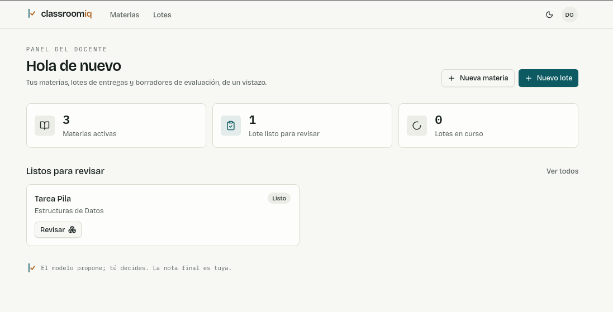
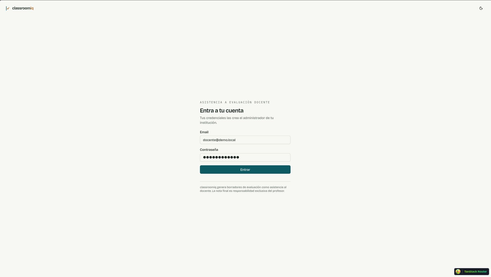
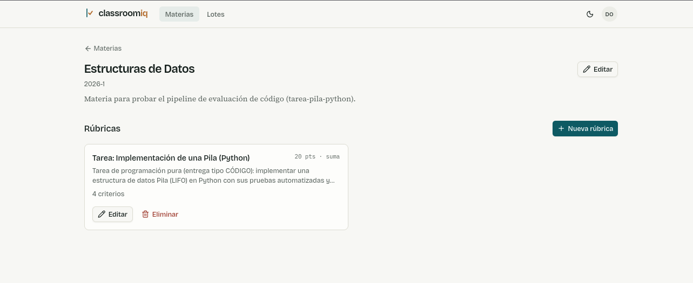
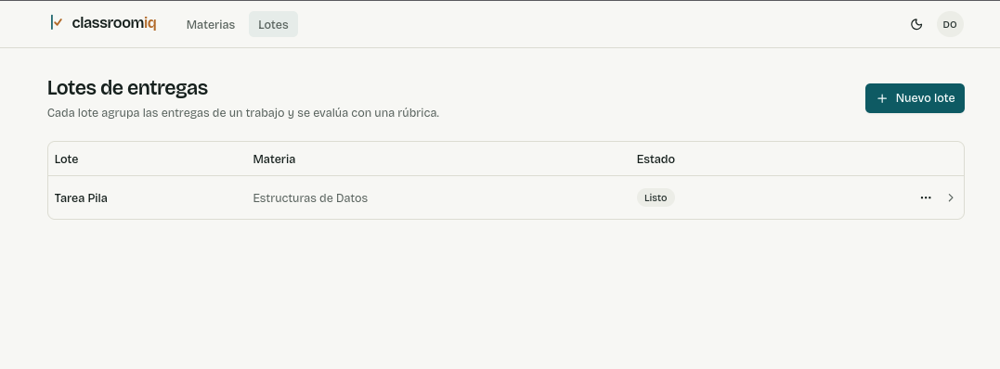
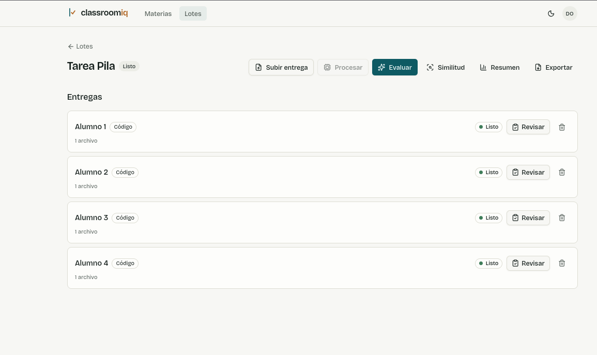
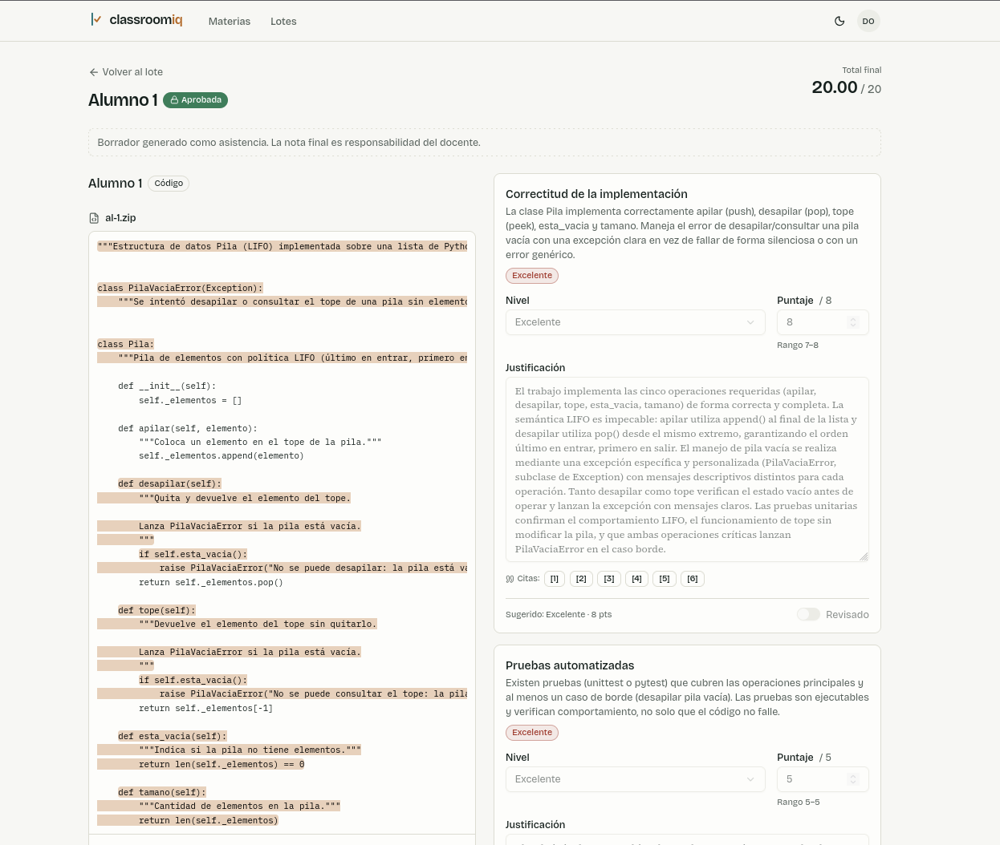
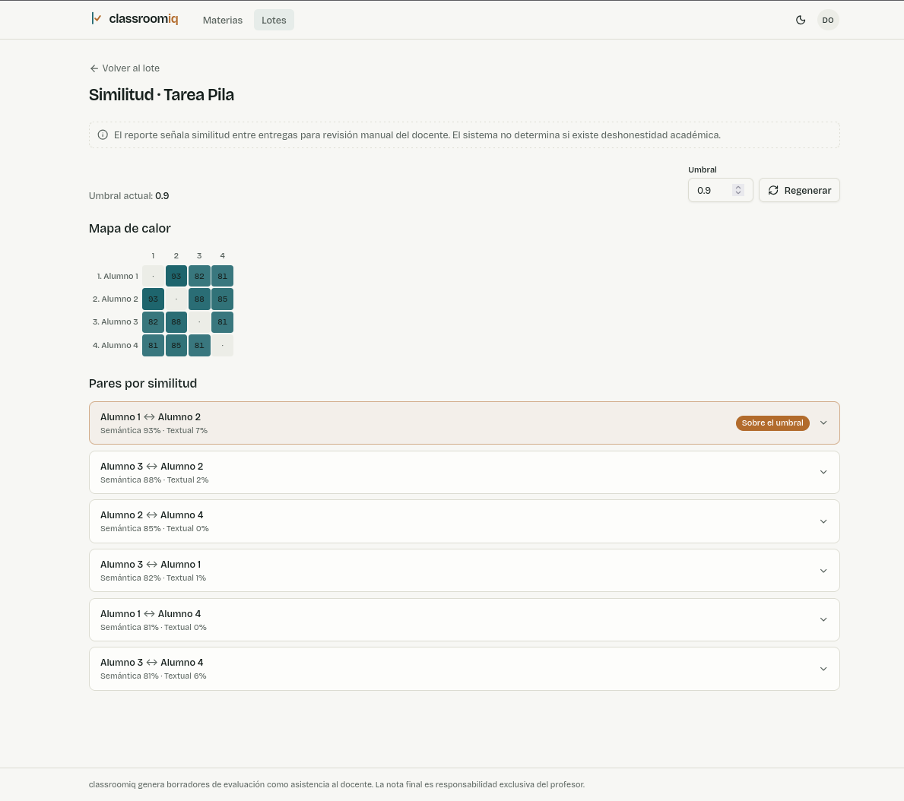
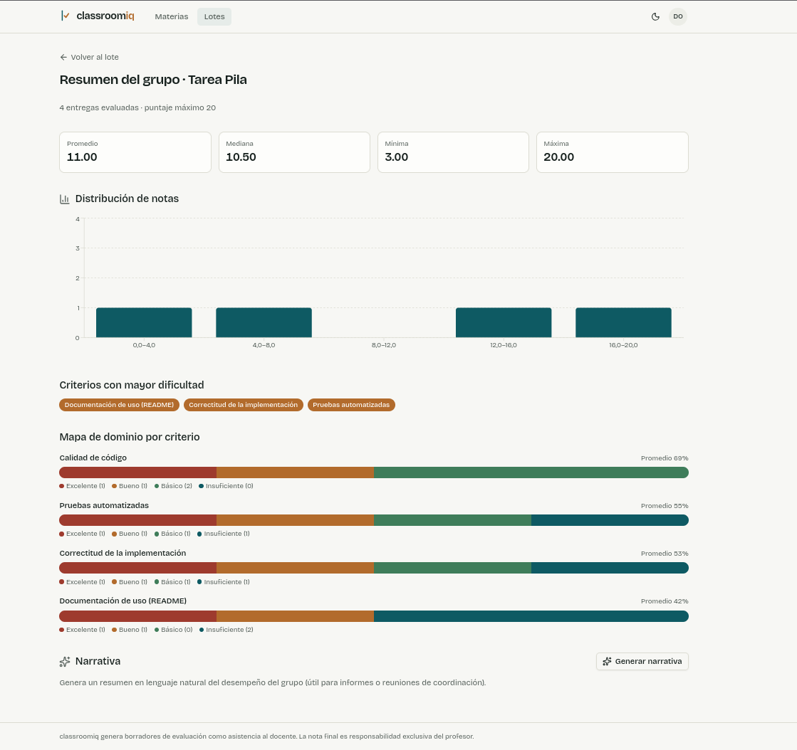
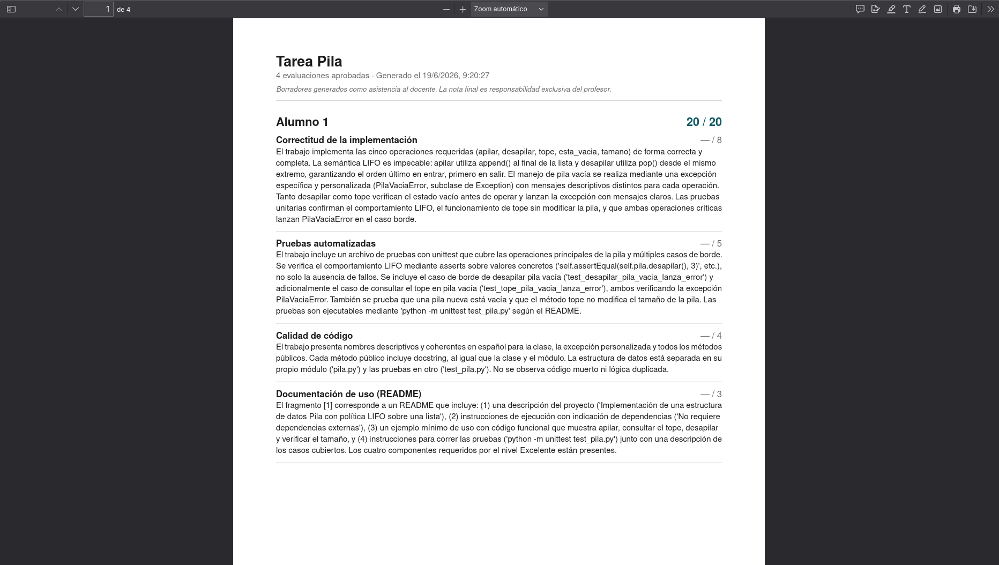
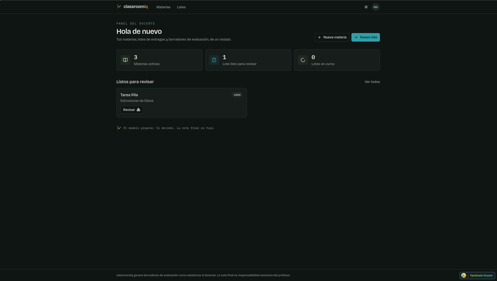

# classroomiq

**Plataforma de asistencia a la evaluación docente universitaria.** El profesor carga las entregas de sus estudiantes junto con una rúbrica, y classroomiq le devuelve **borradores de evaluación fundamentados** —criterio por criterio, con evidencia citada del propio trabajo—, detecta **similitud semántica** entre entregas y produce **reportes agregados por grupo** que revelan dónde dominó y dónde falló la clase.

> **El principio es inamovible: el docente es el juez; la herramienta elimina el trabajo cognitivo repetitivo.** classroomiq **nunca asigna la nota final**. Genera un borrador que el docente revisa, ajusta y aprueba. No es *"IA que califica"* — es un **asistente que prepara la evaluación** y reduce el tiempo de ~45 a ~15 minutos por trabajo **manteniendo el criterio del profesor**.

Esa diferencia no es cosmética: es la que separa una herramienta que genera resistencia institucional de una que genera adopción. Está incrustada en el modelo de datos (lo *sugerido* por el LLM se guarda aparte de lo *final* del docente), en el prompt del motor (citar evidencia, declarar incertidumbre en vez de inventar) y en la UI (el aviso visible en cada pantalla). El *por qué* completo está en [`DESIGN.md`](DESIGN.md).

<p align="center">
  
</p>

---

## Por qué es distinta

- **Borradores con evidencia, no notas mágicas.** Cada criterio trae nivel sugerido, puntaje dentro del rango del nivel, justificación y **fragmentos citados del trabajo** resaltados en su contexto. El docente edita lo que quiera; **aprobar congela** la evaluación.
- **Similitud semántica, no comparación de texto.** Con `pgvector` detecta trabajos que comunican las mismas ideas con otras palabras —técnicamente superior al plagio textual, especialmente en código, donde dos implementaciones del mismo algoritmo son similares sin compartir una línea. Siempre como **alerta para revisión manual, nunca como acusación**.
- **Valor institucional, no solo individual.** El resumen por grupo (estadísticas, mapa de dominio por criterio y narrativa en lenguaje natural) le sirve al docente y al coordinador de carrera.
- **Tres tipos de entrega desde el MVP:** documento (PDF/DOCX), código (ZIP), y mixta (informe + código), cubriendo los casos reales de carreras técnicas.
- **Multi-tenant con aislamiento real:** admin, docente y coordinador, con datos de cada docente completamente aislados.

---

## El flujo, en imágenes

### 1. Acceso por institución

Sin auto-registro: el **admin** crea las cuentas. El JWT porta `tenant_id`, identidad y rol; el aislamiento por tenant se aplica en cada consulta.

<p align="center"></p>

### 2. Materias y rúbricas

El docente organiza su trabajo en **materias**, y dentro define **rúbricas** con criterios y niveles de desempeño. El modelo de puntaje es de **puntos absolutos por criterio** (total por suma o promedio), con niveles por-criterio que aceptan rango, puntaje fijo o banda porcentual. La rúbrica es el contexto principal que recibe el LLM — cómo escribir criterios evaluables está en [`RUBRIC-GUIDE.md`](RUBRIC-GUIDE.md).

<p align="center"></p>

### 3. Lotes de entregas

Un **lote** (p. ej. *"Tarea Pila — Estructuras de Datos"*) agrupa las entregas de un trabajo y se evalúa con una rúbrica. El docente sube cada entrega con un alias —no hacen falta datos personales.

<p align="center"></p>

### 4. Procesar y evaluar (en background, con estado en vivo)

Desde el lote se dispara el pipeline: **procesar** (extracción de texto, chunking y embeddings) y **evaluar** (el LLM genera el borrador por criterio). El estado de cada entrega (`pendiente → procesando → evaluando → listo`) llega **en tiempo real por SSE**.

<p align="center"></p>

### 5. Revisión lado a lado — *la pieza central*

Donde el docente pasa la mayor parte del tiempo. **Izquierda:** el documento/código completo de la entrega con los **fragmentos citados por el LLM resaltados en su contexto**. **Derecha:** el borrador por criterio —nivel sugerido, puntaje acotado al rango (editable), justificación reescribible y los chips de cita que hacen scroll al texto original. El **total se proyecta en vivo**; aprobar congela.

<p align="center"></p>

### 6. Reporte de similitud

Mapa de calor de todos los pares del lote + lista ordenada por similitud (semántica y textual). Los pares sobre el umbral —**configurable y recalculable en vivo**— se marcan para revisión manual, con el aviso explícito de que el sistema no determina deshonestidad académica.

<p align="center"></p>

### 7. Resumen por grupo

Estadísticas del lote (promedio, mediana, distribución de notas), **criterios con mayor dificultad**, **mapa de dominio por criterio** y una **narrativa generada por LLM** lista para un informe o una reunión de coordinación.

<p align="center"></p>

### 8. Exportación

Las evaluaciones aprobadas se exportan en **PDF** (y Excel/CSV) por lote, listas para comunicar por el canal habitual del docente. No hay portal estudiantil: classroomiq prepara la evaluación, el docente la entrega.

<p align="center"></p>

### Modo oscuro

<p align="center"></p>

---

## Roles

| Rol | Qué hace | Qué **no** ve |
| --- | --- | --- |
| **Admin institucional** | Crea/activa/desactiva cuentas, asigna materias a coordinadores, ve métricas de **uso y costo** del LLM (con alerta de umbral mensual). | Contenido de entregas ni evaluaciones individuales. |
| **Docente** | Materias, rúbricas, lotes, procesamiento, revisión y aprobación, similitud, resúmenes, exportación. | Datos de otros docentes (aislamiento total). |
| **Coordinador** | Acceso de **solo lectura** a los resúmenes agregados de las materias asignadas. | Trabajos individuales, evaluaciones específicas ni similitud. |

---

## Stack

- **Backend:** Spring Boot 3.5 (Java 21) — MVC para la API, **WebFlux + SSE** para el estado de procesamiento; Flyway, MapStruct; Spring Security + **JWT propio**.
- **Base de datos:** PostgreSQL + **pgvector** (índice HNSW, coseno, vectores normalizados, dim 1024).
- **Embeddings:** `bge-m3` vía **Ollama** local (proveedor intercambiable cloud/local).
- **LLM:** API de Anthropic — `claude-sonnet-4-6` para el análisis por criterio, `claude-haiku-4-5` para tareas simples (proveedor intercambiable; salida estructurada por JSON-en-prompt + parseo).
- **Frontend:** React 19 + TypeScript, Vite, Shadcn/Tailwind v4, **TanStack** Router/Query/Table, cliente de API generado desde `openapi.yaml`.
- **Infra:** Docker Compose (Postgres + Ollama), expuesto vía **Cloudflare Tunnel**.

Decisiones de diseño y trade-offs: [`DESIGN.md`](DESIGN.md). Contrato de la API: [`openapi.yaml`](openapi.yaml) (OpenAPI 3.1). Detalle por capa: [`backend/README.md`](backend/README.md) y [`frontend/README.md`](frontend/README.md).

---

## Despliegue

### Requisitos

- **Docker** + **Docker Compose** (Postgres con pgvector y, opcionalmente, Ollama).
- **JDK 21** (el backend trae `./mvnw`, no hace falta Maven global).
- **Node ≥ 20** y **pnpm** (frontend).
- **Ollama** con el modelo `bge-m3` (en el host o como contenedor del compose).
- Una **API key de Anthropic** para el motor de evaluación.

### 1. Configuración

```bash
git clone <repo> classroomiq && cd classroomiq
cp .env.example .env                      # raíz: Postgres, JWT, CORS, Ollama, Anthropic, costos, storage
cp frontend/.env.example frontend/.env    # VITE_API_URL (default http://localhost:8080)
```

Edita `.env` y completa al menos `ANTHROPIC_API_KEY`. El resto trae defaults razonables para desarrollo.

### 2. Infraestructura (Postgres + Ollama)

```bash
docker compose up -d db                          # PostgreSQL+pgvector en localhost:5436 (configurable)
docker compose --profile ollama up -d ollama     # opcional: Ollama en localhost:11434
docker compose exec ollama ollama pull bge-m3    # descarga el modelo de embeddings (dim 1024)
```

> Si corres Ollama directamente en el host, omite el servicio del compose y deja`OLLAMA_BASE_URL=http://localhost:11434`. Si el backend también fuera contenedor, usa `http://ollama:11434`.

### 3. Backend

```bash
cd backend
./mvnw spring-boot:run                 # API en http://localhost:8080
```

Flyway aplica las migraciones al arrancar (`ddl-auto: validate`). En **desarrollo** el `DataSeeder` siembra de forma idempotente la institución demo y las cuentas de prueba (off en prod/tests):

| Rol | Email | Contraseña |
| --- | --- | --- |
| Admin | `admin@demo.local` | `admin12345` |
| Docente | `docente@demo.local` | `docente12345` |
| Coordinador | `coordinador@demo.local` | `coord12345` |

### 4. Frontend

```bash
cd frontend
pnpm install
pnpm gen:api                           # genera el cliente TS desde ../openapi.yaml
pnpm dev                               # http://localhost:5173
```

Entra en `http://localhost:5173` con cualquiera de las cuentas del seed: el **dispatcher por rol** te lleva a tu portal (docente → `/materias`, admin → `/admin/cuentas`, coordinador → `/coordinador`).

### 5. Producción

- **Backend:** activa el perfil `prod`, que **exige sin defaults** las variables sensibles (`DB_URL`/`DB_USERNAME`/`DB_PASSWORD`, `JWT_SECRET`, `ANTHROPIC_API_KEY`), desactiva el seed y baja la verbosidad. Compila y ejecuta el jar:

  ```bash
  cd backend && ./mvnw clean package
  SPRING_PROFILES_ACTIVE=prod java -jar target/*.jar
  ```

- **Frontend:** define `VITE_API_URL` apuntando a la URL pública de la API y compila la SPA estática:

  ```bash
  cd frontend && pnpm build      # genera dist/, servible por cualquier estático (nginx, Caddy…)
  ```

- **CORS:** en prod, `CORS_ALLOWED_ORIGINS` debe ser el dominio donde se sirve la SPA (exigido, sin default).
- **Exposición:** la API y la SPA se publican vía **Cloudflare Tunnel** (`fepdev.app`), sin abrir
  puertos entrantes en el servidor.
- **Datos sensibles:** los archivos de entregas se guardan en disco local (`STORAGE_BASE_PATH`) y **no salen del servidor**; el coordinador nunca ve evaluaciones individuales y el admin no accede al contenido de los trabajos.

---

## Tests

- **Backend:** 90+ tests (JUnit + Testcontainers levanta Postgres+pgvector real) — `cd backend && ./mvnw test`.
- **Frontend:** Vitest + Testing Library + MSW para lógica y hooks — `cd frontend && pnpm test:run`.
- **E2E (Playwright):** camino crítico del docente, portales admin y coordinador, más pases de **accesibilidad (axe, WCAG AA)** y **responsive** sobre las vistas multi-rol. Requieren el stack vivo
  — `cd frontend && pnpm e2e`.

---

## Documentación

| Documento | Contenido |
| --- | --- |
| [`DESIGN.md`](DESIGN.md) | Decisiones de diseño: asistente-no-reemplazante, aislamiento multi-tenant, similitud semántica sobre textual, modelo de rúbrica, motor LLM. |
| [`RUBRIC-GUIDE.md`](RUBRIC-GUIDE.md) | Guía para docentes: cómo escribir criterios evaluables por el LLM, con ejemplos buenos y malos. |
| [`openapi.yaml`](openapi.yaml) | Contrato de la API (OpenAPI 3.1) — fuente de verdad del cliente del frontend. |
| [`backend/README.md`](backend/README.md) | Arquitectura, configuración, perfiles y testing del backend. |
| [`frontend/README.md`](frontend/README.md) | Arquitectura, scripts, convenciones y testing del frontend. |

---

<p align="center"><em>classroomiq genera borradores de evaluación como asistencia al docente.<br>
La nota final es responsabilidad exclusiva del profesor. El sistema no reemplaza el criterio académico humano.</em></p>
